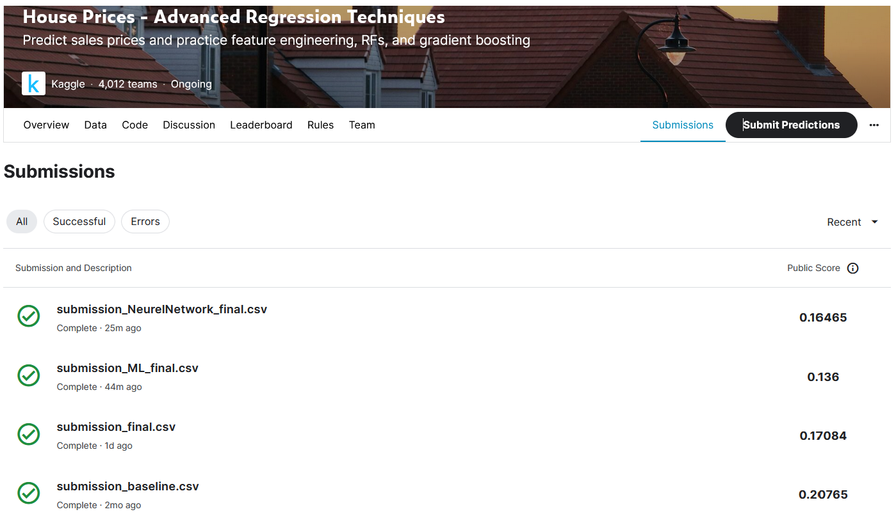

# houses_kaggle_competition
## My first deep learning model

During our training at Le Wagon Data Science bootcamp, we practice our freshly learned skills on an open source data base from Kaggle:

This is a challenge propose by kaggle in which we are provided with housing market of Boston, based on various criteria we are given the associate prices of the houses in the dataset.

Then we are provided with a test dataset for which we need to proivde predicted prices. Kaggle will then allow us to submit our prediction and give us a score on our prediction.

The explorative steps and processing of the data can be found in [Baseline_pipe Jupyter Notebook](https://github.com/pgducray/houses_kaggle_competition/blob/main/Baseline_pipe.ipynb)

My first Neural Network can be viewed in [My First Neural Network](https://github.com/pgducray/houses_kaggle_competition/blob/main/my_first_neural_network.ipynb)

In this project, I submitted 3 different predictions to Kaggle.

## The approach

In this challenge we explored various ways to optimise our predictions.
We first work on preprocessing the data to see which data can help us optimise our prediction.
Then we tried various machine learning models to establish a baseline.
Finally we tried our first Neural Network for our final submit.

## Key Finding

During this exercise, we see that feature engineering have an important impact on the prediction score and training time. It is definitly worth spending the time to do it properly once and have a preprocsseing function that can be used for further traingin.

Additionnaly, a Neural Network is not always the best solution and we should carefully explore the baseline by iterating different machine learning models.
Of course, my first Neural Network is a very basic one and can be greatly enhance which also add more complexity.
Neural Network are limited to the amount of data available, which Machine Learning Model advantages when analysising smaller datasets.

### Baseline Model

The first submission is a preprocessed baseline model using a DecisiongTree Regressor
This return a good starting score which is assesed by a Root Mean Square Log Error (RMSLE). An RMSLE of 0.22 means that, on average, our model's predictions of house prices are off by about 22% when compared to the actual prices on a logarithmic scale.

### Optimised Machine Learning Model

For our second model, we focused on optimising the features in our dataset:
 - Imputer : which replace missing values using different strategies
 - Ordinal encoder : For exemple, features that had ['bad', 'average', 'good'] input, we encode them into number : [0,1,2]. Having number instead of string is much better for our model.
 - Scalers : scale large numerical values to be small ratios so that our model does get misled when comparing large numbers with smaller numbers.
 - OneHotEncoder : When converting string features to numbers, the model can establish a ranking between the features, thus we create new columns for each string features using 0 or 1 value to indicate their presence or not. For instance, if a house has a garage or a driveway, we'll have two columns 'Garage' and 'Driveway' with 0 or 1 to indicate their presence on the property.
 - Statistical feature selection :  Adding a SelectPercentile filter will filter out features that, taken individually, least explain your target.

Then we tried different estimators for our model and ended up using Support vector machines (SVMs)  for our second estimation.

This improved our score from 0.17 to 0.136.

### Simple Neural Network

For my first Neural Network, I used the same preprocessing function that was iterated in the Optimised Machine Learning Model.
Then intead of using Support vector machines (SVMs), I used a basic Neural Network.

This returned us a score of 0.164

